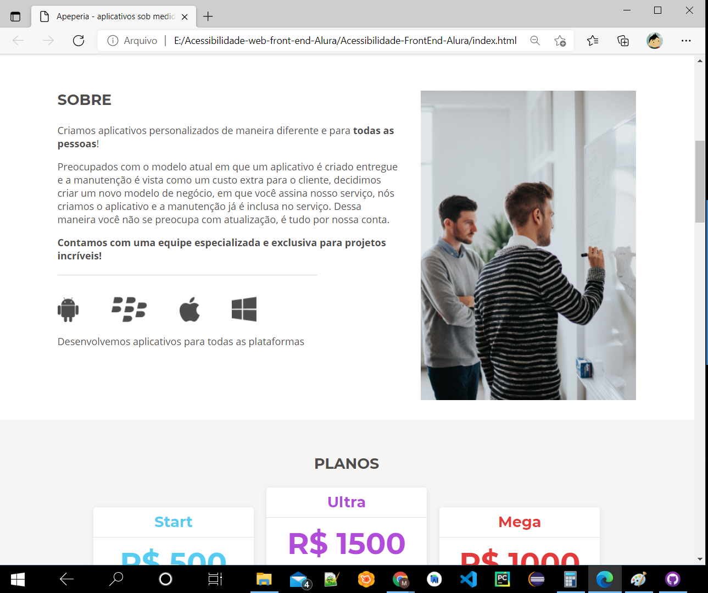
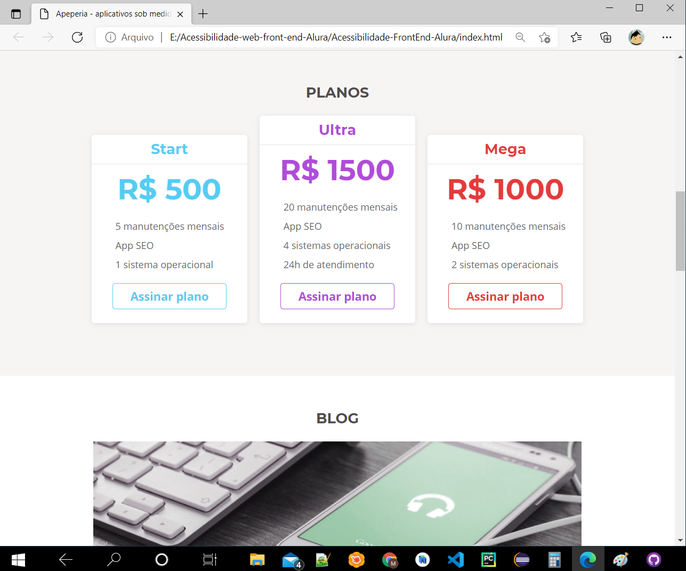
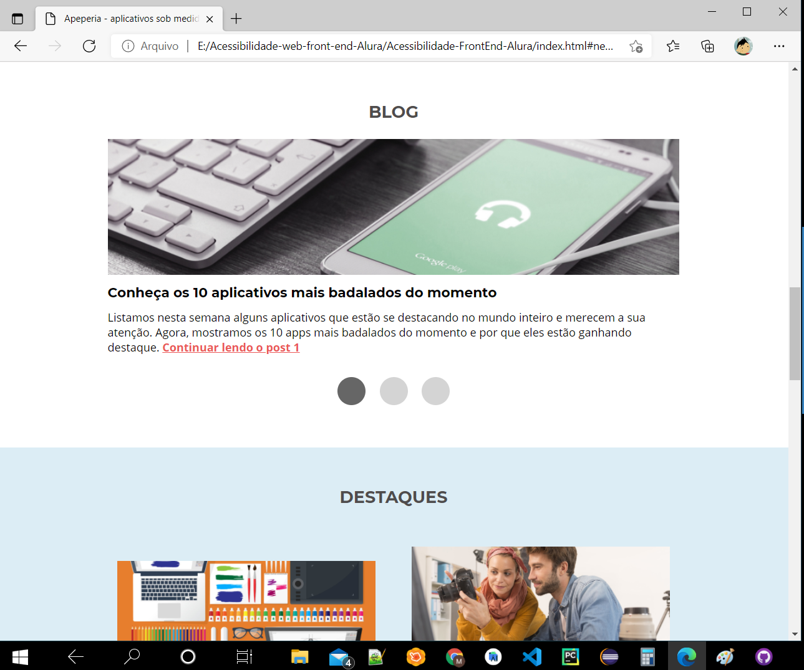
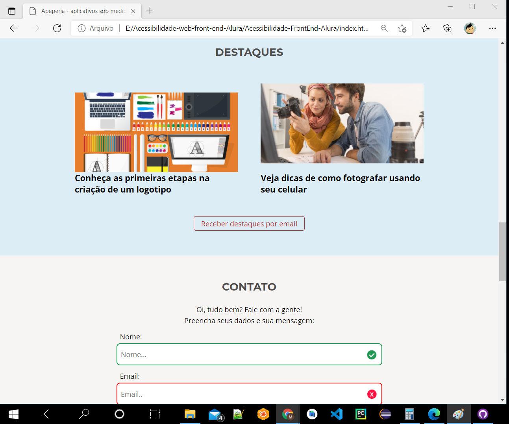
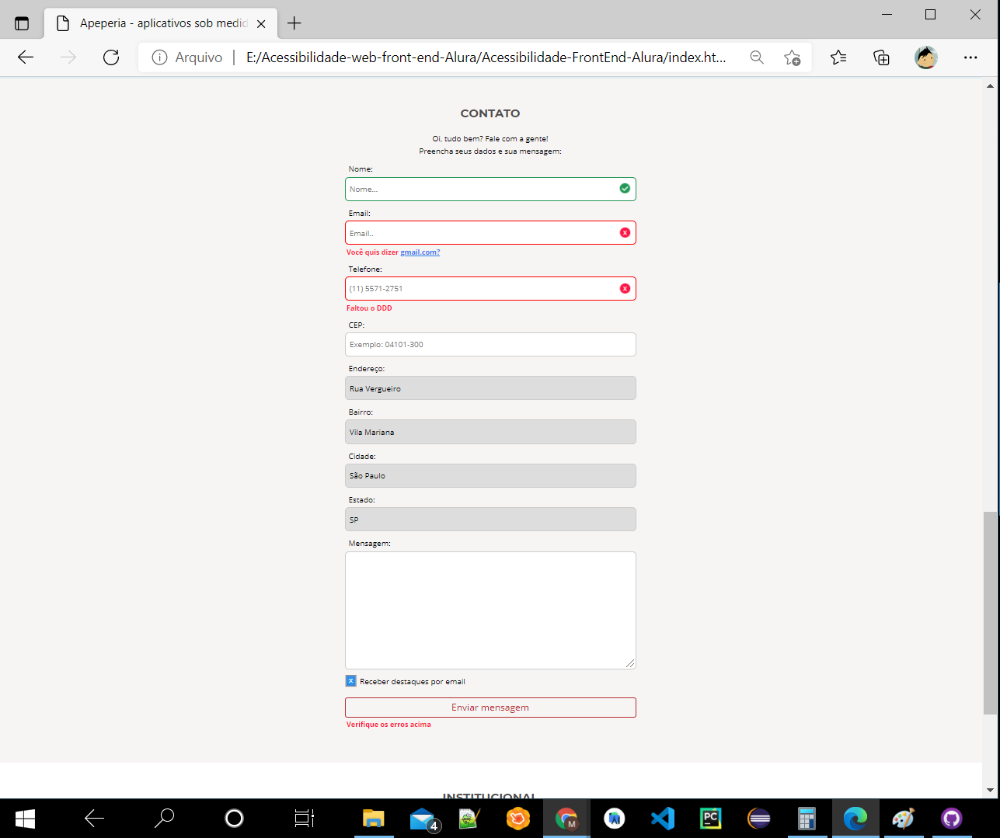
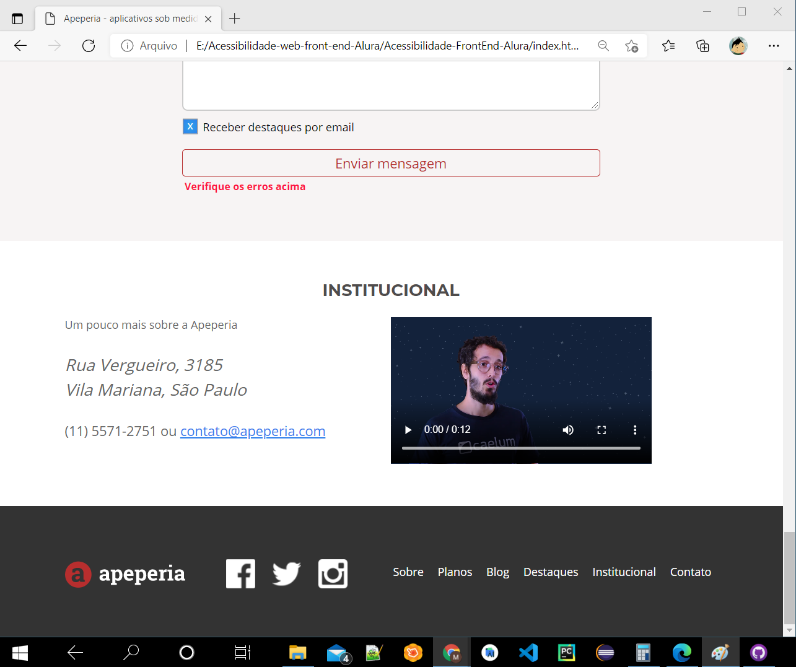

# Site Apeperia-Alura
## A Apeperia-Alura é uma startup com um jeito inovador de comprar e montar aplicativos mobile e web para pequenas e médias empresas

<h1 align="center">
  
</h1>

 <a href="#sobre-o-projeto">Sobre</a> •
 <a href="#funcionalidades">Funcionalidades</a> •
 <a href="#layout">Layout</a> • 
 <a href="#tecnologias">Tecnologias</a> • 
 <a href="#user-content--licença">Licença</a>

<h4 align="center"> 
	🚧  Apeperia-Alura Finalizado  🚧
</h4>

## 💻Sobre o projeto

A Apeperia-Alura foi um projeto que desenvolvido durante os módulos de formação de front-end da Alura no que diz respeito a acessibilidade.

Esse projeto foi totalmente focado em usuários que fazem uso dos leitores de tela, especificamente o NVDA que está se torando a ferramenta mais popular entre os usuários. Também foi visto conceitos de boas práticas como a importância do atributo lang para experiência do usuário e como organizar o atributo para frases em outro idioma. Conhecemos, também, o atributo alt e seus processos descritivos com imagens. Conhecemos a ferramenta automática desenvolvida pelo Facebook e suas limitações.

---

## ⚙Funcionalidades

-Basicamente o site consiste de apenas 1 página pois o fim é apenas didático e introdutório no que diz respeito em acessibilidade, sendo essa criada o index, onde nela foi aplicado todas as boas praticas e tags para facilitar a interpretação do usúario a respeito da página:

  Página Index:
  
  Nesta página estava localizada as informações sobre a apeperia, planos com valores e diferenças entre eles, um campo que direcioana ao blog, uma área que está localizada os destaques e no final a área de contato com um formulário completo. 
  
  
  
  
  
  
  
  
  
  
  
  
  
  
  ---

## 🎨Layout

Os aquivos tanto de hmlt e css foi fornecido pelo professor do Alura 
[Natan Souza](https://www.linkedin.com/in/designernatan/)

### 🛠Tecnologias

As seguintes ferramentas foram usadas na construção do projeto:

- [HTML](https://www.w3schools.com/html/default.asp)
- [CSS](https://www.w3schools.com/css/)
- [VisualStudio](https://visualstudio.microsoft.com/pt-br/)

---

## 📝Licença

Este projeto esta sobe a licença [MIT](./LICENSE).

Feito por Marcelo Laurentino👋🏽 [Entre em contato!](https://www.linkedin.com/in/marcelo-laurentino-8a54ba114/)
